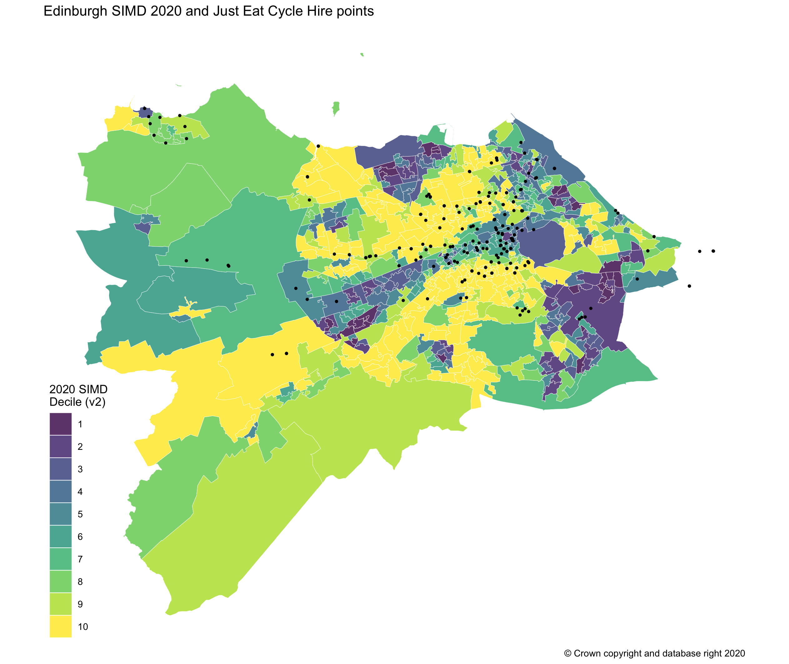
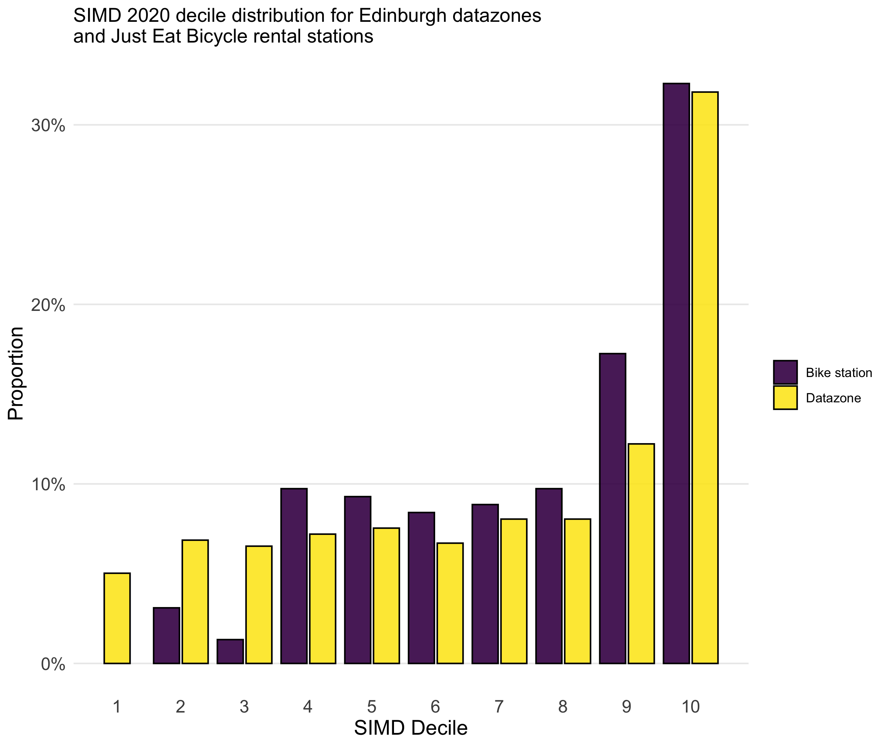

I recently saw a [Twitter](https://twitter.com/david_mccraw/status/1562055269034639361) thread pointing out the location of existing public bike hangars in Edinburgh were seemingly correlated with lower levels of multiple deprivation. It got me thinking if the same could be said for the now defunct public bike hire scheme Edinburgh had between 2018 and 2021.

The station data are listed on Open Data Scotland, and can be accessed directly from [usmart.io](https://usmart.io/org/cyclingscotland/discovery/discovery-view-detail/8550147c-9ce2-4382-929d-3b4ab43e554f). I extracted all start and end station names and coordinates registered over the period the scheme existed, and get all unique rows. This might overestimate the number of stations, and does not account for cases where multiple bike racks were kept at one location. 

In any case, plotting the coordinate stations on a datazone map of Edinburgh, where each datazone is coloured according to which SIMD decile it sits shows there could be a tendency for areas with comparatively higher rates of multiple deprivation at the national level to have a disproportionally smaller share of the bike stations. However, it is quite hard to tell for sure given the varying sizes of datazone area.

To get a better feel, I plotted the distribution of SIMD deciles for Edinburgh datazones, and compared that to the decile distribution for bike station locations. I think this does confirm that areas with the highest comparative rates of multiple deprivation had a lower that proportionate share of the bike stations. This doesn't tell us why that is the case - it could be station location is correlated with population density (while datazones do have a roughly standardised population, it can vary between a population size of 500 and 1000). The bike hire scheme was also a commercial enterprise, so it's not surprising that the city center would be allocated a higher proportion of stations, where you were expect there to be a higher number of people in the day. 

However, it does also seem to be the case that if you exclude those datazones that are in the centre, there are even fewer areas of higher multiple deprivation allocated bike stations. However, this could also be linked to good, safe bicyle routes. Regardless, the end result is that certain areas of Edinburgh benefited more than others in terms of allocated bike stations.

